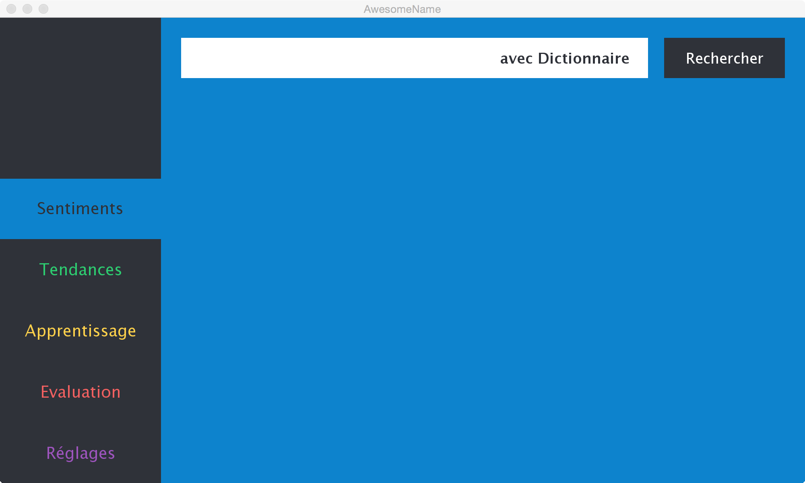
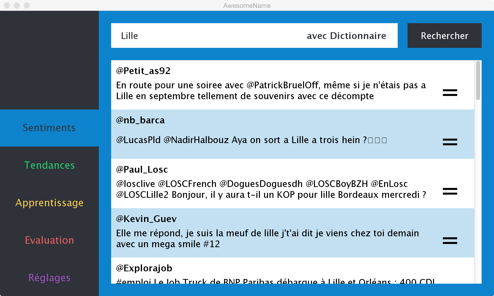
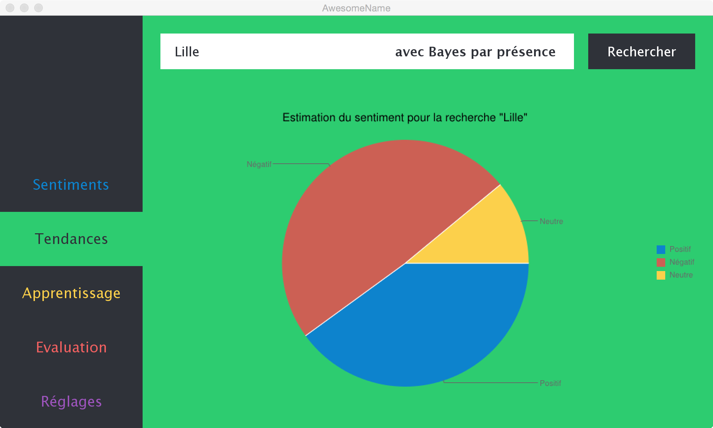
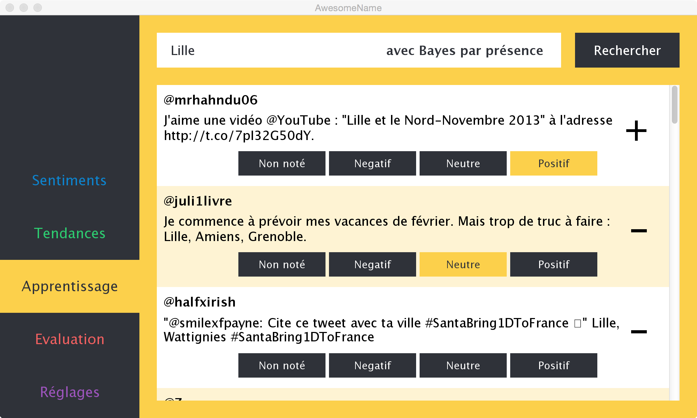
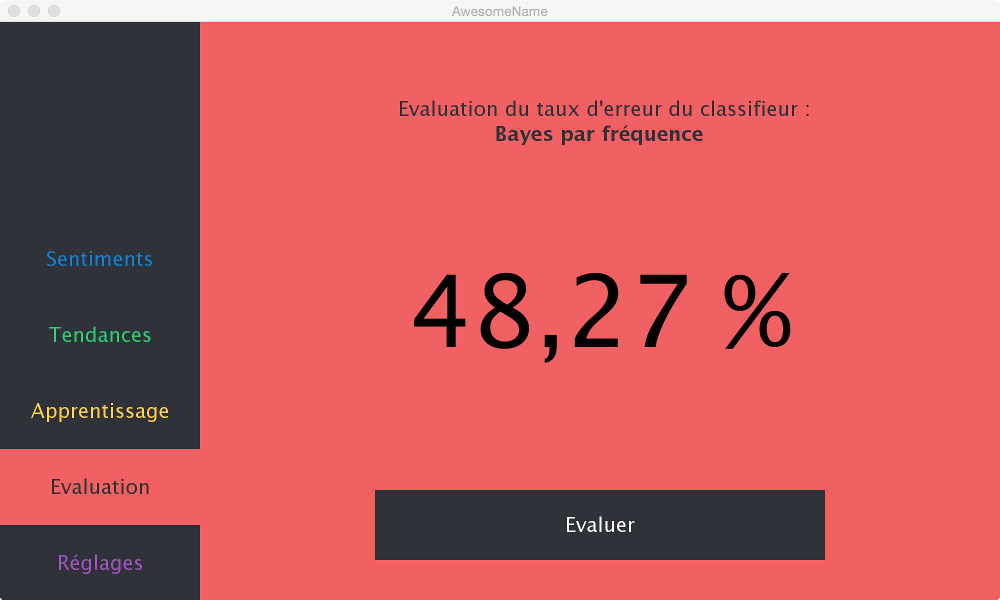
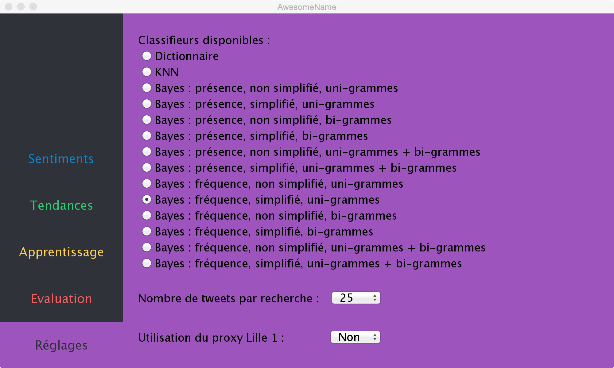

Quentin Baert  
Thomas Bernard

# Rapport PJE

## Description générale du projet

### Description de la problématique

Le but du projet était de créer une application capable de donner le sentiment général sur Twitter à propos d'un sujet en particulier.  
Le sentiment d'un tweet peut être représenté par trois classes : positif, négatif, neutre.

Afin de determiner le sentiment à propose d'un sujet, une requête à l'API Twitter est faite avec le sujet en tant que mot clef.  
Un certain nombre de tweets à propos du sujet sont ainsi récupérés.

Une fois les tweets récupérés, il faut alors les analyser pour les répartir dans les différentes classes et ainsi en déduire le sentiment dominant à propos du sujet.

### Description générale de l'architecture de notre application

Les sources de l'application ont été divisées en plusieurs packages :

* **feeling** : contient l'ensemble des classes relatives aux sentiments et à l'attribution d'un sentiment à un tweet,

* **utils** : contient l'ensemble des classes utilitaires de l'application. Ces classes permettent d'ajouter une abstraction aux objets proposés par la librairie **twitter4j**. Par exemple, la classe *Tweet* fournie une abstraction d'un tweet représenté par une instance de la classe *Status* dans **twitter4j**. Ainsi une instance de *Tweet* ne contiendra que les informations nécéssaires au bon fonctionnement de l'application.

* **statistics** : contient l'ensemble des classes qui permettent de faire des statistiques depuis les données de l'application. Ce package contient la classe *CrossValidation* qui permet de faire une évaluation d'un classifieur en usant de la méthode de cross validation. Il contient également la classe *PieChartBuilder* qui permet de générer les diagrammes circulaires concernant les classifications d'un classieurs sur une liste de tweets.

Les packages suivants contiennent les différents composants d'une architecture en MVC.

* **model** : contient la classe *AppModel*, modèle de l'application.

* **controller** : contient la classe *AppController*, contrôleur de l'application.

* **view** : contient l'ensemble des classes constituant la vue de l'application.

* **app** : contient la classe *Main* de l'application.

## Détails des différents travaux réalisés

### API Twitter

Pour pouvoir interroger l'API Twitter, nous avons utilisés la librairie **twitter4j**. Cette librairie donne accès au singleton *TwitterFactory*, qui permet d'accéder à l'API Twitter ainsi qu'aux classes suivantes :
* *Query* : requête
* *QueryResult* : résultat d'une requête (ensemble de *Status*)
* *Status* : tweet et toutes les informations associées

Ces classes sont uniquement utilisées dans la méthode *model.AppModel.search*. Une fois la recherche effectuée, les instances de *Status* deviennent des instances de *Tweet*. Ce sont ces instances de *Tweet* qui seront manipulées par la suite.

Afin de fixer le nombre de tweets récupérés et de s'assurer que ces tweets soient écris en alphabet latin, les opérations suivantes sont effectuées sur l'instance de *Query* utilisée pour la recherche depuis une chaine de caractères *searchQuery* :  

```  
Query query = new Query( searchQuery );

/* Assure le fait que les tweets récupérés soient en alphabet latin */
query.setLang( "fr" );

/* Fixe le nombre de tweets récupérés lors de la requête */
query.setCount( this.tweetsNb );
```

### Préparation de la base d'apprentissage

##### Nettoyage des données

Afin de nettoyer les tweets sauvegardés dans la base d'apprentissage, un singleton *MessageCleaner* est utilisé.  
Ce dernier est constitué de plusieurs méthodes qui prennent une chaine de caractères et renvoient cette dernière nettoyée. Les chaines de caractères sont nettoyées à l'aide d'expressions régulières et de la méthode *String.replaceAll*.  
Nettoyer le message d'un tweet revient donc à le faire passer dans chacune des méthodes du *MessageCleaner*.

Afin de pouvoir facilement ajouter une méthode de nettoyage dans le *MessageCleaner*, la réfléxivité est utilisée lors de sa construction afin de construire une liste de fonctions à appliquer pour nettoyer totalement le message d'un tweet. Pour cela, une méthode chargée du nettoyage doit commencer par `delete` pour être considérée comme telle et être utilisée.  

```
/* Constructeur de MessageCleaner */
private MessageCleaner () {
  this.methods = new ArrayList< Method >();

  for ( Method m : this.getClass().getMethods() ) {
    if ( m.getName().startsWith( "delete" ) ) {
      this.methods.add( m );
    }
  }
}
```

##### Construction de la base

Notre base d'apprentissage est abstraite dans une instance de la classe *TweetPool* qui correspond à un ensemble de tweets. Cette dernière est créée à l'ouverture de l'application et remplie à partir d'un fichier **tweetPool.csv** si ce dernier existe. Une fois la *TweetPool* créée, toutes les manipulations seront faites sur cette abstraction. Le fichier **tweetPool.csv** est réécrit à la fermeture de l'application pour sauvegarder le nouvel état de la base d'apprentissage.

Nous avons décidé de construire la base d'apprentissage "à la main" afin que celle-ci soit la plus précise possible.  
Pour cela, nous avons utilisé l'écran **Apprentissage** de notre application qui affiche des tweets obtenus depuis une requête et propose de leur associer un sentiment. Une fois ce sentiment indiqué, ces tweets sont sauvegardés dans la *TweetPool* du modèle et servent immédiatement aux classifications demandées par la suite.

### Algorithmes de classification

*Hierarchie de classe des Classifiers*

##### Mots clefs

*DictionnaryClassifier*

##### KNN

*KNNClassifier*

##### Bayes

*BayesClassifier + toute la sous hierarchie*

### Interface graphique

L'interface de notre application se décompose en deux éléments.  
A gauche, une barre latérale fait office de menu et permet de naviguer entre les différentes fonctionnalités de l'application. A droite, la partie principale de la fenêtre, représente les différentes fonctionnalités liéss à l'analyse de sentiments sur Twitter.

Dans le détail, le menu permet d'accéder à :

- **Sentiments** :  
Cet écran permet d'effectuer une recherche sur un thème particulier, d'obtenir les tweets correspondants à cette recherche et d'indiquer pour chaque tweet le sentiment déterminé par nos algorithmes.  

- **Tendances** :  
Comme pour la section **Sentiments**, cet écran permet d'effectuer une recherche sur un thème particulier mais cette fois les tweets ne sont pas individuellement affichés. En revanche, une estimation du sentiments des tweets trouvés est effectuée puis affichée sous forme de diagramme circulaire.

- **Apprentissage** :  
Cet écran permet d'effectuer une recherche sur un thème particulier et de définir manuellement un sentiment sur un tweet. Le sentiment déterminé par notre application est indiqué à titre de comparaison, mais c'est à l'utilisateur de choisir le sentiment approprié, dans le but d'ajouter ce tweet à notre base d'apprentissage et améliorer les algorithmes de classifications.

- **Evaluation** :  
Cet écran permet d'évaluer la qualité du classifieur utilisé par l'application. Le classifieur est utilisé sur l'ensemble de la base d'apprentissage pour déterminer le taux d'erreur de celui-ci.

- **Réglages** :  
Cet écran permet de modifier le comportement de l'application. Trois paramètres sont ainsi configurables :  
	- *Classifieur* : Permet de choisir le classifieur à utiliser dans le reste de l'application
	- *Nombre de tweets* : Permet de choisir le nombre de tweets à utiliser/analyser dans le reste de l'application
	- *Proxy Lille 1* : Permet d'activer ou non l'utilisation du proxy Lille 1 pour l'accès à l'API Twitter

##### Copies d'écrans


Page d'accueil de l'application


Recherche de tweets sur le mot-clé "Lille", et affichage du sentiment déterminé à partir du classifieur Dictionnaire


Recherche d'une tendance sur le mot-clé "Lille", et affichage d'un diagramme circulaire donnant la répartition entre tweets positifs, négatifs et neutres, à partir du classifieur Bayes par présence


Recherche de tweets sur le mot-clé "Lille", affichage des résultats avec indication du sentiment à l'aide du classifieur Bayes par présence. Les différents boutons sous chaque tweet permettent de lui associer un sentiment et de l'ajouter à la base d'apprentissage


Evaluation du classifieur actuellement utilisé par l'application, c'est à dire Bayes par fréquence, et calcul en temps réel de son taux d'erreur


Paramètres de l'application, avec choix du classifieur à utiliser, du nombre de tweets à traiter simultanément et de l'utilisation du proxy Lille 1

##### Manuel d'utilisation

**/!\\ L'application Tweel nécessite Java 7 ou ultérieur**

L'application Tweel est fournie sous la forme d'un fichier JAR.

Ce fichier JAR s'accompagne d'un dossier `resources` et d'un fichier `twitter4j.properties`. Ces deux éléments sont indispensables au bon fonctionnement de l'application.

- `twitter4j.properties` contient les tokens d'auhentifications à l'API Twitter. En l'état, l'application peut être utilisée avec les accès fournis mais vous pouvez utiliser des tokens différents.

- `resources` est un dossier contenant les fichiers :
	- `negative.txt` est utilisé par le classifieur Dictionnaire pour identifier les mots à connotation négative.
	- `positive.txt` est utilisé par le classifieur Dictionnaire pour identifier les mots à connotation positive.
	- `tweetPool.csv` est le fichier qui contient la base d'apprentissage. Celui-ci se met à jour automatiquement lorsque vous notez manuellement des tweets dans la section Apprentissage de l'application.

Exécution de l'application :  
```
java -jar tweel.jar
```

## Résultat de la classification avec les différentes méthodes et analyses

*Tester les différents classifiers ?*

## Conclusion

*Bah c'était cool...*
